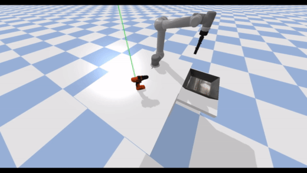
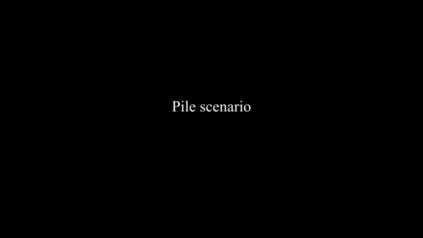

## Learning to Grasp Objects in Highly Cluttered Environments using Deep Convolutional Neural Networks

###### Jeroen Oude Vrielink, [Hamidreza Kasaei](https://hkasaei.github.io/) | [video](https://youtu.be/fXpZMnZUZoA) | [thesis](https://fse.studenttheses.ub.rug.nl/25369/)

##
<p align="center">
  
  
  


</p>
<p align="left">
   Our experimental setup consists of a UR5e robotic arm, an RGB-D camera, a set of objects placed on the desk in three scenarios: (left) isolated scenario, (center) packed scenario, and (right) pile scenario. The green line denotes the camera’s line of sight.
</p>

# ur5-robotic-grasping
This repository implements the grasp inference method of Kumra et al. (2020) in a robotic simulation developed in PyBullet. Kumra et al. (2020) propose a generative residual convolutional neural network which predicts one or multiple antipodal grasps using both RGB and depth images of the object scene. Three different grasping scenarios have been implemented. These include objects in isolation, objects packed together, and objects in a pile (Kasaei et al., 2021). 

All code in the directory 'network' is an adaptation of Kumra's open source code that was taken from the following repository: https://github.com/skumra/robotic-grasping  
The simulation code is an adaptation from the following repository: https://github.com/ElectronicElephant/pybullet_ur5_robotiq  
Object models were taken from the following repository: https://github.com/eleramp/pybullet-object-models

## Requirements

Ensure you are running Python>=3.6.5 and import the required libraries by running:
```
pip install -r requirements.txt
```

It will install a set of packages, including: numpy, opencv-python, matplotlib, scikit-image, imageio, torch, torchvision, torchsummary, tensorboardX, pyrealsense2, Pillow, pandas, matplotlib, pybullet

## Demo
Running the script 'demo.py' gives a demonstration of the simulation. The demo can be run with three different grasping scenarios. Run 'demo.py --help' to see a full list of options.

Example:
```bash
python demo.py --scenario=isolated --runs=1 --show-network-output=False
```
## References
Sulabh Kumra, Shirin Joshi, and Ferat Sahin.  Antipodal robotic grasping using generative residual convolutional neural network. In 2020 IEEE/RSJ International Conference on Intelligent Robots and Systems(IROS), pages 9626–9633, 2020. doi: 10.1109/IROS45743.2020.9340777.

Hamidreza Kasaei and Mohammadreza Kasaei. MV-grasp: Real-time multi-view 3D object grasping in highly cluttered environments. arXiv preprint arXiv:2103.10997, 2021
